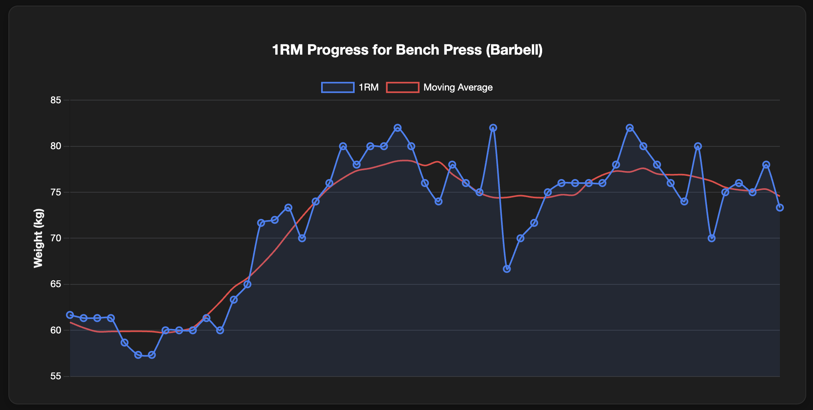

# 📈 Hevy CSV Visualizer

**A simple, client-side web app to graph and analyze your workouts using exported data from the [Hevy App](https://www.hevyapp.com/).**
No login, no servers, no API keys — just upload your CSV and instantly get insights.

---

## 🔗 View here

👉 [View the App](https://adamad44.github.io/Hevy-App-Data-Visualiser/)

---

## 🖼️ Screenshots

---

## ⚙️ Features

-   📤 **Simple CSV Upload**: Instantly visualize your Hevy export file.
-   🔒 **100% Client-Side**: Your data is never uploaded to a server, ensuring complete privacy.
-   **Dashboard with Key Metrics**:
    -   Total workout count & total volume (KG)
    -   Average workout duration & volume per workout
    -   Average reps per set & time between workouts
    -   Most common & most improved exercises
-   **Detailed Graphs for Each Exercise**:
    -   1RM (One-Rep Max) progression with moving average
    -   Heaviest weight progression with moving average
    -   Reps per set over time with moving average
-   **Overall Trend Analysis**:
    -   Total volume per workout over time
    -   Workout frequency by time of day
    -   Workout frequency by day of the week

---

## 🛠️ Getting Started

1.  Export your workout data from the Hevy app as a `.csv` file.
2.  Visit the [app](https://adamad44.github.io/Hevy-App-Data-Visualiser/).
3.  Drag and drop or select your CSV file.
4.  View your workout analytics!

---
